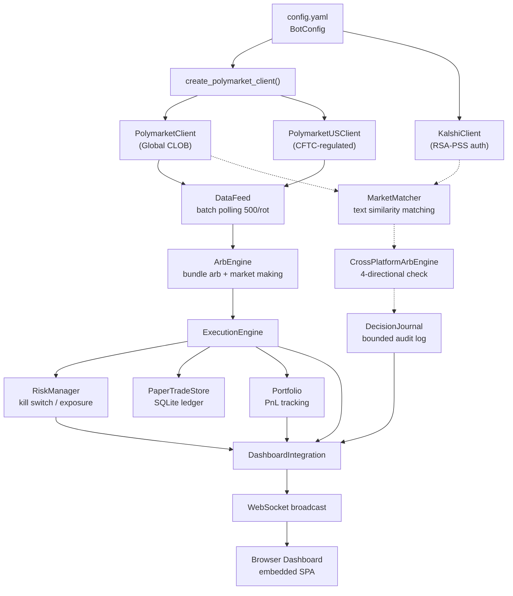

# Polymarket Arbitrage Bot

**Production Readiness Assessment & Gap Analysis**

- Status: **PRE-PRODUCTION**
- Operating mode: **DRY-RUN ONLY**
- Report snapshot: July 2026
- Reported scope: ~8,500 lines of Python, 18 test files, 3 platform clients, and a web dashboard

> This Markdown document faithfully transcribes the findings and recommendations in
> `.lavish/production-readiness.html`. Its claims are the starting audit, not newly
> verified conclusions. Later nightwatch work must test them against the repository,
> official exchange documentation, and safe runtime evidence.

## Executive summary

| Measure | Reported value | Detail |
|---|---:|---|
| Codebase lines | 8,500+ | Python across 40+ files |
| Test coverage | 18 files | ~1,700 test lines |
| Strategies | 3 | Bundle, market making, cross-platform |
| Production readiness | 0% | Never placed a real order |

## 1. System architecture

How data flows from exchanges through detection to execution and dashboard:

- Solid arrows: wired end-to-end.
- Dashed arrows: detection exists but execution path is incomplete.
- Orange in the source diagram: the US client exists but is untested live.
- Red in the source diagram: missing pieces.

## 2. Current state: what works

### Mature and well-tested (as reported)

- **Bundle Arbitrage Engine** — buys YES+NO when `total_ask < 1.0`, sells when `total_bid > 1.0`; fee-aware, with duration tracking and cooldown logic.
- **Market Making Engine** — places inside-spread limit orders, supports one-sided market making, and is tick-size-aware.
- **Polymarket Global Client** — Gamma API markets, CLOB orderbooks (real and simulated), and batch polling with rate limiting for 5,000+ markets.
- **Risk Manager** — kill switch, per-market/global/strategy exposure limits, and daily-loss and drawdown triggers.
- **Portfolio Tracker** — FIFO cost basis, realized and unrealized P&L, and win/loss statistics.
- **Paper Trading Ledger** — SQLite store with full lifecycle events (placed → filled/cancelled/expired) and decision linking.
- **Web Dashboard** — FastAPI + WebSocket SPA showing markets, opportunities, orders, portfolio, risk, decisions, and timing statistics.
- **Configuration System** — YAML with environment-variable overrides, three risk presets (conservative/balanced/aggressive), and extensive validation.
- **Backtesting** — single-platform simulation with random-walk orderbooks and cross-platform historical replay.
- **Test Suite** — 18 files covering the arbitrage engine, portfolio, risk, execution, cross-platform replay, configuration, paper store, Kalshi authentication, and US parsing.

### Incomplete or untested

- **Zero Live Orders** — neither Polymarket Global, Polymarket US, nor Kalshi has ever placed a real order.
- **Kalshi Can't Trade** — the client fetches markets and orderbooks but has no order-placement method. Missing: `place_order()` and `cancel_order()`.
- **Cross-Platform Execution Stops at Detection** — `CrossPlatformArbEngine.check_arbitrage()` finds opportunities and writes to DecisionJournal + Dashboard, but `ExecutionEngine` never consumes cross-platform signals.
- **Polymarket US Untested Live** — the US client wraps the SDK and supports order placement, but has never been tested against the live exchange with real funds.
- **No Wallet/Funding Setup** — Polygon USDC wallet, Kalshi deposit, and Ed25519 API keys are all templated but not set up.
- **ClobTradingBridge Untested** — wraps `py_clob_client_v2` for live CLOB trading but has never placed an order against the live exchange.
- **No Monitoring Alerts** — logs exist but there are no Telegram, Discord, or email notifications for trades, errors, or kill-switch events.
- **No Deployment Story** — no Dockerfile, systemd/launchd service, healthcheck endpoint, or restart-on-crash mechanism.

## 3. Gap analysis: what blocks production

The source report rates each gap by severity and estimated effort and orders them by dependency. The “acceptance evidence” below restates the source's “what's missing” as an observable completion criterion; it does not claim completion.

| ID | Gap | Severity | Effort | Acceptance evidence / what's missing | Blocks |
|---|---|---|---|---|---|
| G1 | Polymarket Global Live Order | **Critical** | 2–4 hrs | Wallet funded with USDC; API keys generated; `ClobTradingBridge` wired to the real CLOB; one BUY order at minimum size; environment configured for `POLYMARKET_PRIVATE_KEY`. | G3, G4 |
| G2 | Kalshi Order Placement | **Critical** | 4–8 hrs | Implement `place_order()` and `cancel_order()` on `KalshiClient`; add `get_order()` for fill tracking; use Kalshi REST `POST /orders` with RSA-PSS authentication; correctly handle Kalshi's Yes/No binary model. | G4, G9 |
| G3 | Cross-Platform Execution Pipeline | **Critical** | 6–12 hrs | Wire `CrossPlatformArbEngine` output into `ExecutionEngine`; translate `CrossPlatformOpportunity` into dual `Signal` objects; place on both platforms; acknowledge fills on both sides; enforce cross-platform risk checks; handle timeout and one-sided-fill states. The source calls placement “atomic,” but also identifies one-sided fills as a risk. | — |
| G4 | Live Mode Config & Secrets | **High** | 1–2 hrs | Populate live configuration from `config.live.yaml.example` and `config.live.us.yaml.example`; generate Polymarket API keypair and fund Polygon wallet; generate Kalshi RSA keypair and deposit funds; set up Ed25519 keys for US Polymarket; wire environment variables to `config_loader`. | G1, G2, G5 |
| G5 | Order Safety Limits for Live | **High** | 2–4 hrs | Add configurable caps for open orders, orders per minute, daily order count, and position count. Conservative live defaults: $5 minimum order, $15 maximum order, $50 global exposure, 3 simultaneous open orders, and 5 orders/day. | — |
| G6 | Fee & Gas Model Validation | **High** | 1–2 hrs | Verify the assumed 1.5% taker fee against actual exchange fees; measure real Polygon gas costs for CLOB transactions; verify the claim that Kalshi has 0% fees for most markets; update `config.yaml` `trading.fees`. | G1, G2 |
| G7 | Crash Recovery / Position Reconciliation | **High** | 3–6 hrs | On restart, fetch open exchange orders and positions, reconcile them with `Portfolio`, and replay missed fills so a crash cannot silently leave positions in limbo. | G1, G2 |
| G8 | Monitoring & Alerting | **Medium** | 3–6 hrs | Add rate-limited Telegram notifications for trade executions, kill-switch triggers, daily P&L summaries, and errors; Discord webhook is an alternative. | — |
| G9 | Market Match Quality Validation | **Medium** | 2–4 hrs | Manually audit a sample of pairs produced by the 0.6-threshold, category-grouped `MarketMatcher`; add a dashboard matched-pairs view with approve/reject controls. | — |
| G10 | Kalshi Orderbook Depth Limitation | **Medium** | 2–4 hrs | Account for Kalshi returning bids while asks are derived (`ask_yes = 1.0 - best_bid_no`); add a safety discount/confidence factor for derived asks, for example trading at only 98% of the derived ask price. | G2 |
| G11 | Manual Kill Switch | **Medium** | 1–2 hrs | Add a dashboard button or API endpoint that manually triggers the kill switch; current behavior only triggers on P&L/drawdown thresholds. | — |
| G12 | Deployment & Persistence | **Low** | 4–8 hrs | Add Dockerfile, Docker Compose configuration, systemd/launchd service definition, healthcheck endpoint, and stdout logging for Docker. Source recommendation: defer until after the first live test. | — |
| G13 | Polymarket US Live Validation | **Low** | 2–4 hrs | Test `PolymarketUSClient.place_order()` with real Ed25519 API keys against the live CFTC-regulated exchange; verify order lifecycle, fill reporting, cancellation, and the different fee structure. | G4 |
| G14 | ML Training Data Pipeline | **Low** | Not for v1 | `utils/training_data.py` builds snapshots and `scripts/collect_training_snapshots.py` collects them, but there is no model, training script, or inference. Source recommendation: collect data passively while trading as future work. | — |

## 4. Roadmap to first $100 live trade

The source proposes a phased approach to real-money trading with minimal risk. These tasks are preserved as audit recommendations, not instructions for this no-live-execution nightwatch run.

### Phase 1 — Single-platform live (Polymarket Global)

- Estimated time: 1–2 days.
- Goal: place one real bundle arbitrage trade on Polymarket Global with $10 risk.

| Task | Details | Source status |
|---|---|---|
| 1. Fund Polygon wallet | Create/fund wallet with $50 USDC on Polygon; bridge if needed. | To Do |
| 2. Generate API credentials | Run `scripts/generate_polymarket_credentials.py` to derive an API key from the wallet key. | To Do |
| 3. Populate live config | Copy `config.live.yaml.example` to `config.live.yaml`; fill in wallet key and API credentials. | To Do |
| 4. G5: Safety limits | Add max-open-orders=3, max-daily=5, min-order=$5, max-order=$15, global exposure=$50. | To Do |
| 5. G6: Fee validation | Verify real taker fees and Polygon gas; adjust configuration. | To Do |
| 6. G11: Manual kill switch | Add dashboard panic button. | To Do |
| 7. G1: First live order | Run `main.py --live` with dry-run off; place one BUY order; verify fill and portfolio. | To Do |
| 8. Run 24-hour observation | Run paper-only with live data; observe opportunity quality, orderbook depth, and latency. | To Do |

Source outcome: after Phase 1, one real trade will have been placed and behavior with live data observed, with approximately $10 maximum at risk.

### Phase 2 — Kalshi integration + cross-platform detection

- Estimated time: 2–3 days.
- Goal: detect real cross-platform opportunities between Polymarket and Kalshi without execution.

| Task | Details | Source status |
|---|---|---|
| 1. Fund Kalshi account | Deposit $50 into Kalshi account. | To Do |
| 2. Generate Kalshi RSA keys | Create RSA keypair, upload public key to Kalshi, configure `config.yaml`. | To Do |
| 3. G2: Kalshi order methods | Implement `place_order()`, `cancel_order()`, and `get_order()` on `KalshiClient`. | To Do |
| 4. G9: Match quality audit | Manually review matched-pair samples for false positives; add dashboard approve/reject. | To Do |
| 5. G10: Kalshi orderbook safety | Add confidence discount on derived asks for thin markets. | To Do |
| 6. Run scanner 48 hours | Collect opportunity count, average edge, and frequency from the live-data scanner. | To Do |

Source outcome: Kalshi client trade-ready; cross-platform scanner running; enough frequency/quality data to decide whether execution is worthwhile.

### Phase 3 — Cross-platform live execution

- Estimated time: 3–4 days.
- Goal: execute real cross-platform arbitrage trades; the source identifies dual-platform “atomicity” as the most complex concern.

| Task | Details | Source status |
|---|---|---|
| 1. G3: Cross-platform pipeline | Wire `CrossPlatformArbEngine` to `ExecutionEngine`; dual-signal translation, risk checks, and “atomic” placement. | To Do |
| 2. G7: Crash recovery | Reconcile positions on restart; fetch open orders from both exchanges. | To Do |
| 3. G8: Monitoring alerts | Telegram notifications for trades, errors, and daily P&L. | To Do |
| 4. Production dry run | Run the full pipeline with $5 minimum orders for 48 hours; monitor every trade manually. | To Do |
| 5. Scale orders | Increase gradually from $5 to $10 to $15 as confidence grows. | To Do |

Source warning: this is the riskiest phase; one venue can fill while the other does not, requiring careful handling rather than assumed atomicity.

### Phase 4 — Hardening & scale

- Estimated time: 3–5 days.
- Goal: production-grade reliability, deployment, and monitoring.

| Task | Details | Source status |
|---|---|---|
| 1. G12: Docker deploy | Dockerfile, Docker Compose, healthcheck, stdout logging. | To Do |
| 2. G13: US Polymarket live | Test `PolymarketUSClient` with real keys; investigate its different opportunities. | To Do |
| 3. Parameter optimization | Backtest varying minimum edge, sizes, and cooldowns to find live configuration. | To Do |
| 4. G14: ML pipeline (passive) | Run snapshot collector alongside trading; do not use it for decisions yet. | To Do |
| 5. Monthly review cadence | Recurring review of P&L, opportunity quality, match accuracy, and fee costs. | To Do |

## 5. $100 budget allocation

The source proposes this split for test capital; no funds are moved by this audit.

| Allocation | Amount | Purpose | Label |
|---|---:|---|---|
| Polymarket Global | $50 | Polygon USDC + gas reserve; bundle arbitrage + market making; most mature strategy; 5–10 small trades maximum. | Primary venue |
| Kalshi | $30 | Cross-platform testing; source claims 0% fees on most markets; matched-pair validation rather than solo trading. | Cross-platform only |
| Reserve / Gas | $20 | Polygon gas (source estimate $0.01–$0.05/transaction), Kalshi withdrawal fees, and unexpected-cost buffer. | Safety buffer |

## 6. Key risks & mitigations

| Risk | Impact | Source mitigation |
|---|---|---|
| **One-sided fill on cross-platform:** buy fills on Polymarket but sell does not fill on Kalshi, or vice versa. | **Financial loss** | Limit orders only; aggressive 30-second timeouts; cancel the unfilled leg and close the open position at market; pair tracking that prevents orphaned legs. |
| **Derived Kalshi asks are wrong:** bid-derived asks may not reflect real thin-market liquidity. | **Financial loss** | Apply 2% safety discount; require depth greater than $100 on both sides; begin with $5 orders. |
| **Market-matching false positives:** text matching pairs different propositions, such as winner versus winning margin. | **Financial loss** | Require manual approval before trading; add date and outcome-type matching (binary versus scalar). |
| **Bot runs away:** a defect rapidly places many orders and drains the account. | **Account drain** | G5 limits (3 open, 5/day), $10 daily-loss kill switch, manual kill switch, and at least 60 seconds between trades. |
| **Exchange API outage mid-trade:** a venue becomes unavailable with an open order. | **Stuck position** | G7 recovery: fetch open orders and positions on restart; cancel stale orders older than five minutes. |
| **Polygon gas spike:** gas consumes edge or causes transactions to fail. | **Unprofitable** | Include gas in edge calculation (reported as already present in `ArbEngine`), cap gas per transaction, and check gas before ordering. |

## 7. Immediate next actions in the source report

1. **Fund wallet:** create a Polygon wallet and deposit $50 USDC.
2. **Generate keys:** run the credential script and set environment variables.
3. **Safety limits:** G5 maximum orders/exposure and kill-switch wiring.
4. **Dry-run 24 hours:** live data, paper trades, and opportunity-flow observation.
5. **First $5 trade:** single bundle arbitrage and end-to-end verification.
6. **Phase 2 preparation:** Kalshi keys and order code while monitoring Polymarket.

## 8. Open questions for product decision

| Question | Context | Source recommendation |
|---|---|---|
| Q1: Which venue first? | Polymarket Global (more mature client, well-tested bundle arbitrage) versus Polymarket US (CFTC-regulated, simpler setup, different fees). | Global |
| Q2: Solo or cross-platform only? | Start with single-platform bundle arbitrage, then add cross-platform, or begin with cross-platform. | Solo first |
| Q3: Order sizing? | $5 minimum (very small edge) versus $2 (smaller, more trades); larger sizes produce fewer trades but cleaner data. | $2–$5 |
| Q4: Laptop or cloud? | Phases 1–2 can run on a Mac; Phase 3+ may need cloud reliability; source estimate for a basic VPS is ~$5/month. | Laptop first |

## Nightwatch safety interpretation

The source roadmap includes funding, live orders, long-running scanners, and production dry runs. Those are explicitly outside the current nightwatch objective's execution boundary. This run may statically validate and harden the relevant code, use mocked/offline tests, and perform narrowly read-only authentication checks, but it must not place, cancel, sign, or simulate submission of an exchange order or start a bot, dashboard, scanner, websocket feed, or collector.
